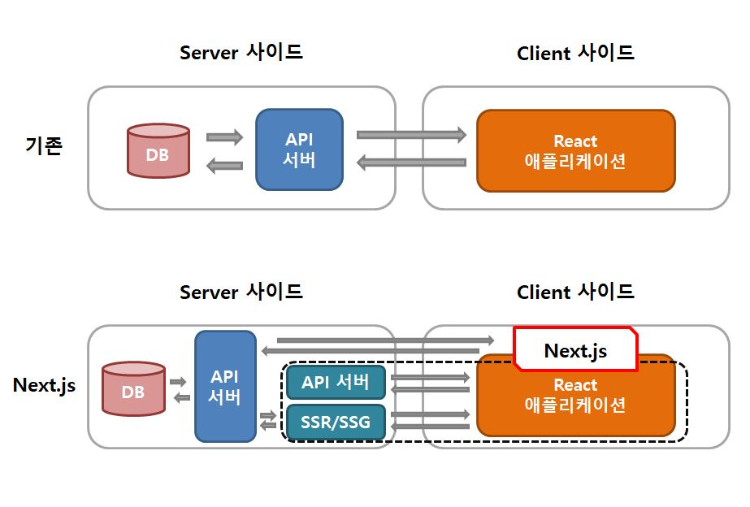
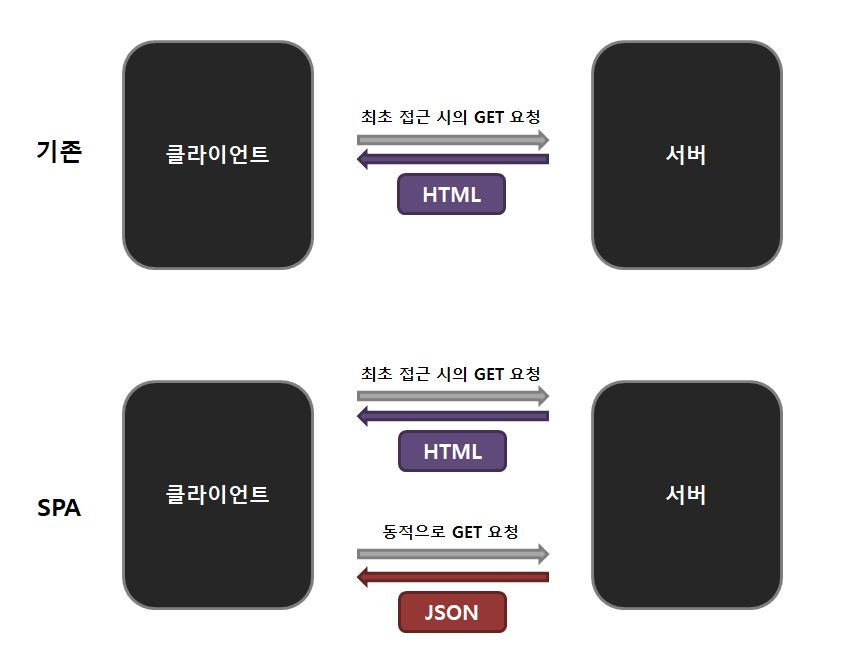

# 1.1 Next.js와 타입스크립트   
### Next.js   
- 오픈 소스 웹 애플리케이션 프레임워크   
- 리액트를 기반으로 구현 및 개발   
- 서버 사이드 렌더링, 정적 웹사이트 생성 등   

### 기존 리액트 애플리케이션 구성 vs Next.js 구성   
기존 - 리액트가 웹 프론트엔드 렌더링에 특화된 라이브러리이기 때문 모든 콘텐츠를 클라이언트 사이드인 브라우저에서 렌더링   
Next.js - 서버 사이드에서 렌더링되는 애플리케이션으로 확장 가능   
   
 :ballot_box_with_check: Next.js = 리액트의 기능성을 살리면서, 리액트만으로는 다룰 수 없는 영역을 포함하는 실전적인 웹 프레임워크

### 타입스크립트
- 자바스크립트에 정적 타입 기능 등을 탑재한 프로그래밍 언어
- 마이크로소프트가 중심 개발
- 자바스크립트를 확장한 AltJS의 하나로 등장

### 타입스크립트로 Next.js(리액트) 웹 애플리케이션 개발
- 개발 효율성 높임
- 우수한 사용자 경험을 실현할 수 있는 모던 프론트엔드 개발

# 1.2 프론트엔드 개발의 변천
## 1.2.1 자바 스크립트 여명기와 제이쿼리의 인기
### 자바스크립트
<1995년>
- 넷스케이프사가 개발
- 브라우저에서 작동하는 스크립트 언어로 등장
- ECMA 표준화 단체에서 자바스크립트 표준을 만들기 시작했으나 이루어지지 못함
- 폼의 유효성 검사로 활용
- 과도한 애니메이션 구현이나 브라우저에 부담을 줌
- 브라우저 크래시를 일으키는 구현 증가
- 악질적인 사이트를 만들어내는 원인이 됨
- 보안상 문제 있다는 인식이 퍼짐
- 프론트엔드의 겉모습을 꾸미는 정도의 보조적인 요소로만 쓰임
<2005년>
- 구글에서 지도 서비스(Google Maps) 출시
- 비동기로 HTTP 통신을 하는 Ajax(Asynchronous JavaScript and XML)를 활용 -> 웹에서 인터랙티브한 애플리케이션 구현
- 페이지를 새로 고치치 않고도 필요한 부분만 서버로부터 정보를 얻어 UI 변경 가능
- 지메일(GMail) 같은 메일 애플리케이션, 실시간성이 높은 분석 도구, SNS 구현, 게임 개발 등에서 자바스크립트 사용
<2008년>
- 크롬(Google Chrome) 브라우저 탄생
- 크롬에 V8(JIT VM 타입의 자바스크립트 엔진) 탑재 -> 실행 속도를 높임
- 웹 애플리케이션 = 브라우저 위에서 작동하는 애플리케이션 (자바 애플릿,플래시 등으로 만든 애플리케이션에 비해 성능이 뒤지지 않음)
- 브라우저만 있다면 설치하지 않고 실행할 수 있는 자바스크립트를 활용한 웹 어플리케이션이 점차 보급

### 제이쿼리 전성기
- RIA(Rich Internet Application) 클라이언트 사이드의 구현
- Ajax, 고도의 DOM 조작 요구됨
- DOM(Document Object Model) 문서 객체 모델 = 브라우저가 HTML을 해석할 때 생성되는 트리 구조의 객체 모델
- 브라우저에서 DOM의 각 노드를 조작하기 위한 API를 제공, 자바스크립트를 통해 조작하여 동적으로 UI 변경
<2014년>
- 거대 브라우저 벤더들의 최신 웹 표준 구현 및 작동 속도 경쟁 치열
- 각 브라우저 벤더가 독자적으로 구현 -> 자바스크립트 엔진과 렌더링 엔진의 작동에 많은 차이 발생
- 모바일용 단말기도 웹 브라우저의 기능을 함께 제공
- 브라우저 사이의 작동의 차이를 어느 정도 고려해 코드를 작성할 수 있는 자바스크립트 라이브러리인 제이쿼리 유행
EX. 자바스크립트 이용 -> Ajax, DOM 이벤트 조작 코드 작성 -> 크로스 브라우저 호환 고려 -> 많은 조건 분기 사용 -> 코드 길어짐
    제이쿼리 이용 -> 간결한 코드 작성 가능

### 제이쿼리 장점
- 크로스 브라우저 호환을 구현 가능
- DOM을 간결하게 조작 가능
- 애니메이션을 간결하게 구현 가능
- jQuery UI 등 주변 라이브러리 풍부

### 제이쿼리 단점
- 글로벌 스코프를 오염
- DOM 조작 구현 복잡해지기 쉬움
- 라우팅 등 여러 페이지의 웹 애플리케이션을 구현하는 구조가 없음
- 브라우저의 표준화로 작동의 차이가 점점 눈에 띄지 않아 브라우저 호환 코드가 필요하지 않음0

## 1.2.2 SPA 등장, MVC/MVVM 프레임워크
### SPA
- 싱글 페이지 애플리케이션(SPA : Single Page Application) : 기동 시에 한 차례 HTML 전체를 로드한 후 사용자 인터랙션에 맞춰 Ajax로 정보를 얻고, 동적으로 페이지를 업데이트하는 웹 애플리케이션
- 빠르게 UI의 작동 실현 가능
- 네이티브 애플리케이션처럼 부드러운 사용자 경험 제공 가능
- 페이지 이동을 클라이언트 사이드에서 수행
- Ajax를 사용하여 필요할 때 필요한 부분만 데이터를 얻어 뷰를 표시 -> 오버헤드가 줄어듦

- JSON 형식의 API가 서버 사이드와 프론트엔드의 연결을 담당하는 설계 보급 -> 빠르게 업데이트 가능
  
